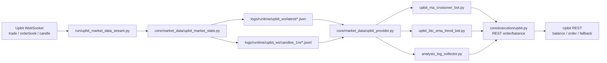

# UPBIT WEBSOCKET TRANSITION PLAN

이 문서는 `REST polling + 짧은 캐시` 구조였던 업비트 실행 경로를, 현재 `시장 데이터는 WebSocket`, `주문은 REST`, `잔고/주문 이벤트는 private WebSocket 수집` 구조로 전환한 기준과 남은 범위를 정리한 문서입니다.

기준 시점:
- 작성일: `2026-04-01`
- 현재 운영 코드 기준 파일:
  - [core/execution/upbit.py](core/execution/upbit.py)
  - [upbit_ma_crossover_bot.py](upbit_ma_crossover_bot.py)
  - [upbit_btc_ema_trend_bot.py](upbit_btc_ema_trend_bot.py)

참고한 공식 문서:
- [Upbit WebSocket Orderbook](https://docs.upbit.com/reference/websocket-orderbook)
- [Upbit Global WebSocket Guide: Real-Time Candle Stream](https://global-docs.upbit.com/docs/websocket)
- [Upbit Global WebSocket Candle Changelog](https://global-docs.upbit.com/changelog/websocket_candle)

## 1. 현재 구현 상태

현재 업비트 경로는 아래처럼 바뀌었습니다.

- 시세:
  - 공개 웹소켓 `trade`
  - 공개 웹소켓 `orderbook`
  - 공개 웹소켓 `candle.1m`
  - 5분/15분은 로컬 1분봉 리샘플
- 잔고:
  - private 웹소켓 `myAsset` 우선
  - 필요 시 REST fallback
- 주문:
  - 주문 생성은 REST
  - 최근 주문 이벤트는 private 웹소켓 `myOrder` 수집

즉 현재는

- `시장 데이터는 WebSocket 네이티브`
- `잔고/주문 이벤트는 private WebSocket 수집`
- `주문 제출만 REST`

상태입니다.

## 2. 전환 목표

### 목표

- 업비트 알트/BTC 봇이 같은 실시간 시세 공급원을 공유하도록 만들기
- `fetch_order_book`, `fetch_ohlcv` 호출 빈도를 크게 줄이기
- `api_latency_ms` 와 체감 반응 속도를 개선하기
- 429 가능성을 더 낮추기
- 현재 주문 경로와 리스크 가드를 최대한 유지하기

### 비목표

- 업비트 주문 생성 자체는 거래소 API 구조상 REST를 유지합니다.
- 잔고 복구/체결 기록 구조를 전부 갈아엎지 않습니다.
- 처음부터 모든 지표를 tick 기반 초고속으로 바꾸지 않습니다.

## 3. 권장 최종 구조

- 시장 데이터:
  - WebSocket 수집기 1개가 공용으로 수신
- 주문:
  - 기존 REST + `ccxt` 유지
- 잔고:
  - private `myAsset` 우선
  - 필요 시 REST fallback 유지
- 봇:
  - 업비트 알트 봇, 업비트 BTC 봇은 공용 시세 공급자(provider)에서 최신 데이터만 읽음
- 장애 복구:
  - WebSocket 수집기가 끊기면 자동 재연결
  - 수집 데이터가 stale 이면 해당 심볼만 REST fallback

핵심 원칙은 다음입니다.

- `주문은 보수적으로 유지`
- `시장 데이터만 실시간화`
- `멀티프로세스 구조에 맞게 공유 공급자 1개를 둔다`

## 4. 왜 전용 수집기 1개가 필요한가

현재 업비트 봇은 프로세스가 분리되어 있습니다.

- 업비트 알트 봇
- 업비트 BTC 봇
- 분석 수집기

이 상태에서 각 프로세스가 각자 WebSocket 연결을 열면:

- 연결 수 증가
- 중복 파싱
- 재연결 로직 중복
- 상태 불일치 위험

따라서 가장 현실적인 구조는:

- `run/upbit_market_data_stream.py` 프로세스 1개
- 이 프로세스가 모든 업비트 실시간 시세를 수신
- 다른 프로세스는 이 수집기가 만든 로컬 스냅샷만 읽기

입니다.

## 5. 권장 데이터 흐름

### 1단계. 수신

WebSocket 수집기가 아래 스트림을 구독합니다.

- `trade`
  - 실시간 체결 가격/수량
- `orderbook`
  - 최우선 호가와 상위 호가
- 선택:
  - `ticker`
  - `candle.1s`

### 2단계. 내부 상태 유지

수집기 내부 메모리에 심볼별 상태를 유지합니다.

- latest trade
- latest top bid / ask
- orderbook timestamp
- 1초 버킷
- 1분봉 집계 상태
- 5분/15분 리샘플 원본 상태

### 3단계. 로컬 스냅샷 기록

멀티프로세스 공유용으로 아래 파일을 씁니다.

- `logs/runtime/upbit_ws/latest/<symbol>.json`
  - 최신 체결/호가/상태 스냅샷
- `logs/runtime/upbit_ws/candles_1m/<symbol>.jsonl`
  - 최근 N개 1분봉 롤링 저장
- `logs/runtime/upbit_ws/health.json`
  - 연결 상태, 마지막 수신 시각, stale 여부

쓰기 정책:

- 모든 tick 마다 디스크 전체 저장은 하지 않음
- `latest` 는 짧은 간격 debounce 저장
- `candles_1m` 는 봉 마감 시점만 append

### 4단계. 전략 봇 소비

업비트 봇은 REST 대신 provider를 읽습니다.

- `get_latest_price(symbol)`
- `get_best_bid(symbol)`
- `get_recent_ohlcv(symbol, timeframe, limit)`
- `is_data_stale(symbol)`

stale 이면:

- 해당 심볼만 REST fallback
- fallback 발생 횟수는 로그에 남김

## 6. 파일 구조 초안

### 새로 추가할 파일

- [run/upbit_market_data_stream.py](run/upbit_market_data_stream.py)
  - 업비트 WebSocket 수집기 실행 진입점

- [core/market_data/upbit_ws_client.py](core/market_data/upbit_ws_client.py)
  - WebSocket 연결/재연결/구독/메시지 파싱

- [core/market_data/upbit_market_state.py](core/market_data/upbit_market_state.py)
  - 심볼별 최신 상태 메모리 모델

- [core/market_data/upbit_snapshot_store.py](core/market_data/upbit_snapshot_store.py)
  - 로컬 JSON/JSONL 스냅샷 저장과 읽기

- [core/market_data/upbit_provider.py](core/market_data/upbit_provider.py)
  - 전략 봇에서 읽는 공통 provider
  - WebSocket snapshot 우선, stale 시 REST fallback

- [tests/test_upbit_snapshot_store.py](tests/test_upbit_snapshot_store.py)
  - 파일 저장/복구 단위 테스트

- [tests/test_upbit_market_state.py](tests/test_upbit_market_state.py)
  - 실시간 시장 상태 갱신 단위 테스트

- [tests/test_upbit_provider.py](tests/test_upbit_provider.py)
  - provider 우선 조회와 fallback 경로 단위 테스트

### 기존 파일 수정 후보

- [core/execution/upbit.py](core/execution/upbit.py)
  - REST fallback helper 유지
  - provider 초기화 helper 추가 가능

- [upbit_ma_crossover_bot.py](upbit_ma_crossover_bot.py)
  - 시세/호가/캔들 조회를 provider 경유로 교체

- [upbit_btc_ema_trend_bot.py](upbit_btc_ema_trend_bot.py)
  - 시세/호가/캔들 조회를 provider 경유로 교체

- [bot_manager.py](bot_manager.py)
  - `upbit_stream` 같은 새 관리 대상 추가

- [README.md](README.md)
  - 운영 흐름 문서 갱신

## 7. 단계별 전환 계획

### Phase 1. 공용 수집기만 추가

- 아직 전략 봇은 그대로 둠
- 별도 프로세스로 WebSocket 수집기만 띄움
- 실시간 latest snapshot 과 1분봉 저장만 확인

목표:

- 끊김 없이 수집 가능한지 확인
- CPU/메모리/로그량 확인

상태:

- 완료

### Phase 2. 호가 조회만 대체

- `fetch_best_bid` 를 provider 우선 구조로 교체
- stale 시만 REST orderbook fallback

목표:

- 업비트 알트/BTC의 `fetch_order_book` 호출 수 감소
- 최소 주문 경계 근처 응답 개선

상태:

- 완료

### Phase 3. 1분봉 조회 대체

- `fetch_ohlcv(..., timeframe="1m")` 를 provider 우선 구조로 교체
- 5분/15분은 1분봉 리샘플 또는 별도 집계

목표:

- 봇 루프의 반복 REST 호출을 크게 줄임

상태:

- 완료

### Phase 4. 분석 수집기 연동

- `analysis_log_collector` 도 provider 기반으로 읽게 조정
- 중복 시세 조회 제거

### Phase 5. WebSocket 우선 운영

- 업비트는
  - 시장 데이터: WebSocket 우선
  - 잔고/주문: REST 유지

## 8. 캔들 집계 방식 권장안

가장 안전한 방식:

- 실시간 `trade` 스트림 기준으로 로컬 1분봉 생성
- 5분/15분은 1분봉 리샘플

이유:

- 현재 전략은 1분/5분/15분 기준이라 구조와 잘 맞음
- `candle.1s` 스트림은 가능하지만, 1초봉 자체를 그대로 운영 기준으로 쓰기보다 trade 기반 집계가 더 일반적입니다.

주의:

- WebSocket candle은 거래가 없으면 빈 구간이 생길 수 있어 보정 규칙이 필요합니다.
- trade 기반 집계도 무거운 건 아니지만, 봉 마감 처리 규칙을 명확히 해야 합니다.

## 9. stale / fallback 규칙

provider는 심볼별 상태를 아래처럼 봅니다.

- `fresh`
  - 마지막 수신이 `2초` 이내
- `warning`
  - 마지막 수신이 `2초 ~ 5초`
- `stale`
  - 마지막 수신이 `5초 초과`

전략 봇 정책:

- `fresh`
  - WebSocket snapshot 사용
- `warning`
  - 그대로 사용 가능하되 warning 로그 기록
- `stale`
  - 해당 심볼만 REST fallback
  - fallback 횟수 누적 기록

## 10. 성능 관점 설계 원칙

- 전략 계산은 tick마다 전체 재계산하지 않음
- 1분봉 마감 기준 계산 우선
- orderbook은 최상위 1~5호가만 유지
- 파일 저장은 debounce
- JSONL append 중심
- 큰 딕셔너리 전체 dump 빈도 최소화

## 11. 현재 프로젝트 기준 예상 장단점

### 장점

- 업비트 반복 `fetch_ohlcv`, `fetch_order_book` 호출 감소
- 429 감소 가능성
- 체감 시세 반응 개선
- 알트/BTC/분석 수집기가 같은 시세를 공유 가능

### 단점

- 수집기 프로세스 추가
- 재연결/누락 복구 로직 필요
- stale/fallback 설계 필요
- 파일 기반 공유를 쓰면 완전한 초저지연 구조는 아님

## 12. 혼합 아키텍처 다이어그램

원본 파일:
- [docs/upbit_hybrid_architecture.svg](docs/upbit_hybrid_architecture.svg)

## 13. 권장 구현 시작점

가장 현실적인 시작 순서는 아래입니다.

1. `run/upbit_market_data_stream.py` 추가
2. `core/market_data` 4종 추가
3. `upbit_provider.py` 로 snapshot 읽기 추상화
4. 업비트 알트 봇에서 `best_bid` 부터 provider 경유로 교체
5. 업비트 BTC 봇도 같은 방식 적용
6. 마지막에 `fetch_ohlcv` 를 provider 우선 구조로 교체

## 14. 결론

현재 프로젝트 기준 최적 해법은 다음입니다.

- `시장 데이터는 WebSocket 수집기 1개로 공유`
- `주문 생성만 REST 유지`
- `잔고/주문 이벤트는 private WebSocket 우선`
- `stale 시만 REST fallback`
- `단계적으로 교체`

즉 “전면 교체”보다 “업비트 시세 공급자만 실시간화”가 현재 구조와 가장 잘 맞습니다.
